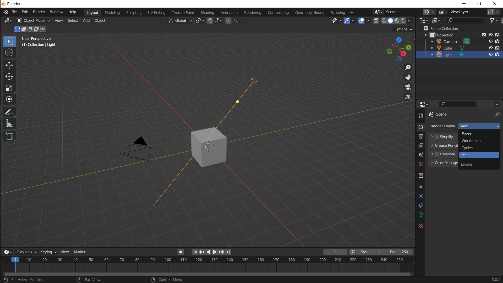
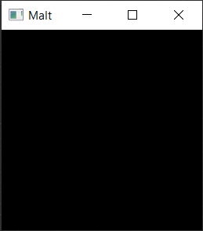
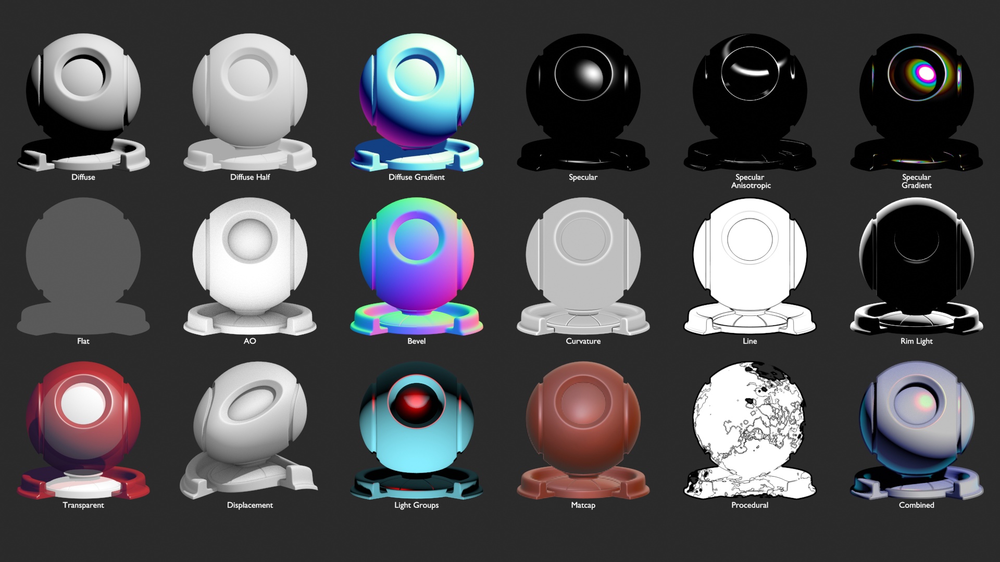

# Gettting Started

## Requirements

- OpenGL 4.5 support.
- Latest Blender stable release.

> A dedicated Nvidia or AMD graphics card is highly recomended.  

## Install
 
- Go to [the latest Release page](https://github.com/bnpr/Malt/releases/tag/Release-latest).
- Download the *BlenderMalt* version that matches your OS.
- Open Blender. Go to *Preferences > Addons*, click on the *Install...* button and select *BlenderMalt.zip* from your downloads. *(This will take a few seconds)*
- Tick the box in the *BlenderMalt* panel to enable it.

> Altenatively, you can download the [Development version](https://github.com/bnpr/Malt/releases/tag/Development-latest) to test the latest features.       

## Uninstall

- Untick the box in *Preferences > Addons > BlenderMalt* to disable the addon.
- Restart *Blender*.
- Go back to *Preferences > Addons > BlenderMalt*, expand the panel and click the *Remove* button.

## Enable Malt

*Malt* is a separate render engine, just like *Cycles* and *EEVEE*.  
To enable it, select *Malt* in *Properties Panel > Render Properties > Render Engine*.

> When *Malt* is enabled, a tiny black window will pop up. This is the process where the renderer runs.  
  
Feel free to ignore it, it's only there because hiding it can lower the process priority and impact the render performance.

## Sample Files

Sample files can be found at [Github](https://github.com/bnpr/Malt/discussions/94).  

## Pipelines

*Malt* allows implementing custom *render pipelines* for advanced use cases.

However, the built-in *NPR Pipeline* is a fully featured and highly customizable pipeline designed to cover most use cases.  

Most parts of this documentation apply only to the *NPR Pipeline*.

> For building custom *render pipelines*, see the [Developer Documentation](https://github.com/bnpr/Malt/tree/Development/Malt#malt).
