# Graphs & Nodes

*Pipelines* and *Plugins* declare their own *Node Tree* subtypes, a.k.a *Graph* types.

Nodes have their own *Malt Node Tree* editor.
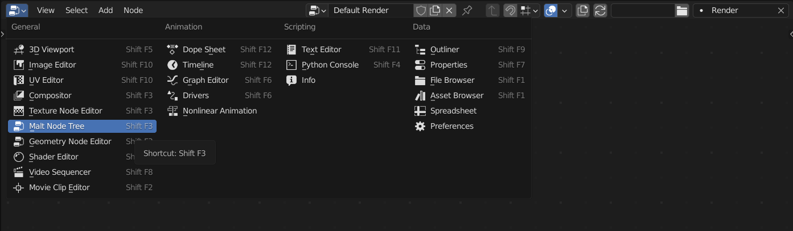

*Pipelines* and *Plugins* can declare their own *Graph* types:

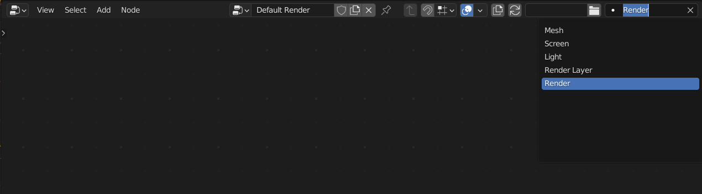

> *Pipelines* and *Plugins* can also declare custom *Node Libraries*.

There are 2 main groups of *Graph* types: *Shader Graphs* and *Render Graphs*.

*Shader Graphs* compile to *GLSL* (*OpenGL Shading Language*), while *Render Graphs* compile to *Python* scripts.  

> These source files can be found in the *.malt-autogenerated* folder alongside their *.blend* file.

*Shader Graphs* are always used from a *Material*. Multiple *Materials* can use the same *Node Tree* while overriding some parameters.

> It's best to reuse *node trees* when possible for improved render performance and shader compilation times.

## Socket Types
 
*Node socket* types keep the *GLSL* naming:

- **bool**  
A value that can be either *true* or *false*.  
- **float**  
A positive or negative number that can have decimals. *(ie: -123.456, -1.0, 0.0, 1.0, 123.456)*  
- **int**  
A positive or negative number that can't have decimals. *(ie: -123, -1, 0, 1, 123)*  
- **uint**  
A positive number that can't have decimals.  *(ie: 0, 1, 123)*  

- **vec2**  
A vector of 2 floats. Used for 2d coordinates, like *UVs*.  
- **vec3**  
A vector of 3 floats. Used for 3d coordinates, like *positions* and *normals*, and *RGB* colors.  
- **vec4**  
A vector of 4 floats. Used for *RGBA* colors.

- **bvec(n)**  
A vector of (n) bools.  
- **ivec(n)**  
A vector of (n) ints.  
- **uvec(n)**  
A vector of (n) uints.  

- **mat4**  
A 4x4 *Matrix*.

- **sampler1D**  
A 1D image (like a color gradient) that holds float values.  
- **sampler2D**  
A 2D image (like a texture) that holds float values.  

- **isampler(n)D**  
An (n) dimesional image that holds int values.  
- **usampler(n)D**  
An (n) dimesional image that holds uint values.  

You can find more details in the [OpenGL wiki](https://www.khronos.org/opengl/wiki/Data_Type_(GLSL)).

### Structs

In addition to basic types, you will also find custom types, a.k.a. *structs*.  
*Structs* are just groups of basic types and/or other *structs*.

For example, a typical *PBR* material setup is composed of albedo *(vec4)*, normal *(vec3)*, roughness *(float)* and metalness *(float)*.

So nodes that operate with these values could pack all of them in a single *PBR_Properties* socket, instead of having them as 4 individual sockets.

*Struct sockets* always expose their subproperties so you can still override them individually if needed.  
So in the *PBR_Properties* example you would see these sockets:  

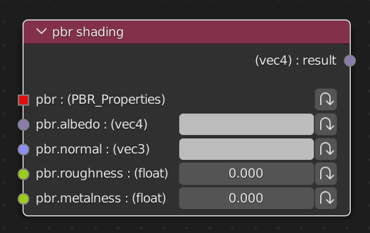

### Arrays

Arrays are lists of multiple values of the same type.  
They are expressed as `type[n]` where `n` is the number of values it stores.  
For example, a socket expressed as `random_colors: (vec4[8])` is a list of 8 values of type *vec4*.

### Opaque Types

In the case of *Python Render Graphs* there are some types, like *Scene*, that can't be edited directly in the node editor.  
However, they can be edited from code in *custom nodes*.

### Automatic type conversion

Conversion between types is handled automatically whenever there's an unambiguous mapping between the 2.  

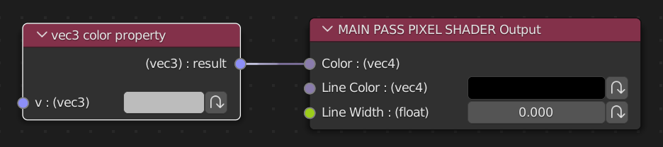

You can add extra automatic conversions by adding functions with the signature:
```glsl
typeB typeB_from_typeA(typeA value);
```
The full list of built-in conversion functions can be found at [Malt/Shaders/Node Utils/conversion.glsl](https://github.com/bnpr/Malt/blob/Development/Malt/Shaders/Node%20Utils/conversion.glsl)

## Node Types
The main categories of nodes are *Functions*, *Structs*, *Inputs/Outputs* and *Other*.

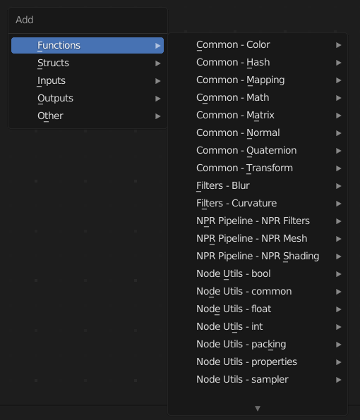

### Functions
This is the most common node type, they behave like a typical node where their inputs are used to compute their outputs.  
In the case of Shader nodes, they're auto-generated from GLSL functions. 

### Structs
Used to pack/unpack and modify struct values.    
In the case of Shader nodes, they're auto-generated from GLSL structs.

> Struct nodes can be used to create a new struct from scratch, override the properties of an existing node or retrieving the value of individual properties:  
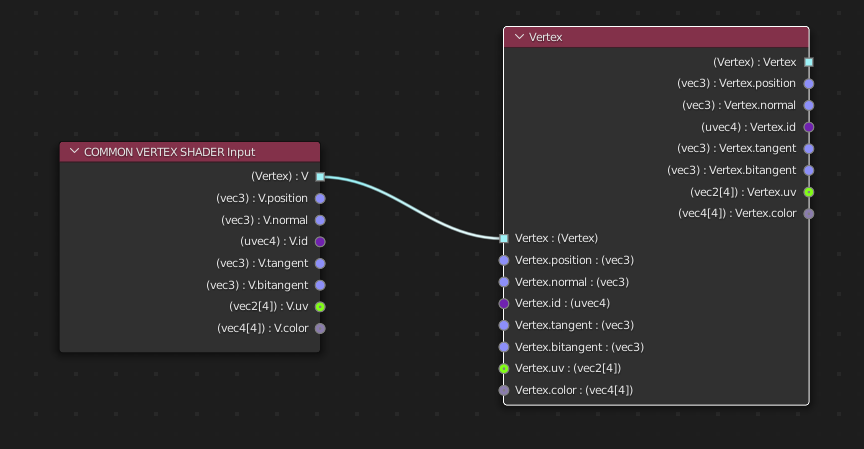

### Other

#### Array
Used to retrieve an individual value from an array.

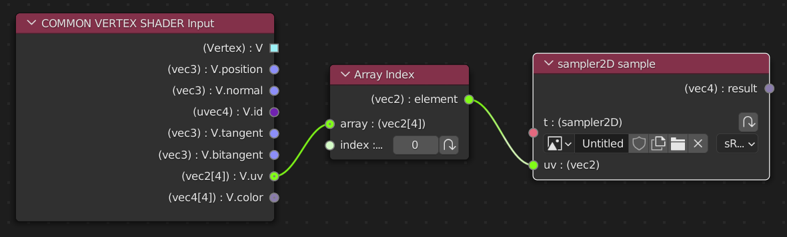

#### Inline Code
Allows you to write value assignment directly in code form. Useful to write math formulas and to workaround the node system limitations.

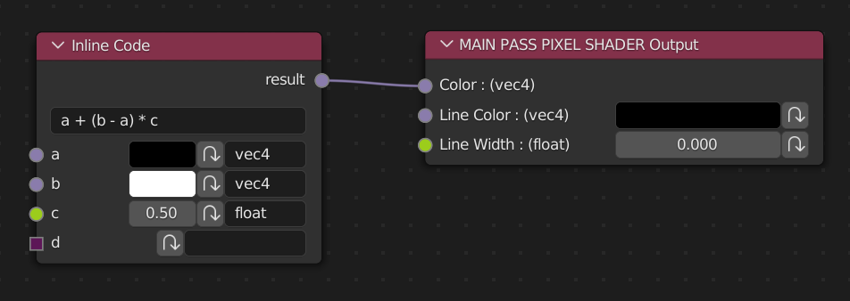

### Inputs/Outputs
Every node system produces a result from some given intputs. Ie, a material computes the color of a surface given some geometry, and render nodes generate an image from the scene data.  

Each graph type has at least one set of input/output nodes, but some of them (like Mesh) have several. 

#### Custom IO
Some IO nodes allow adding extra properties. These are usually known as AOVs (Arbitrary Output Values) in other render engines, but Malt supports custom inputs too.  

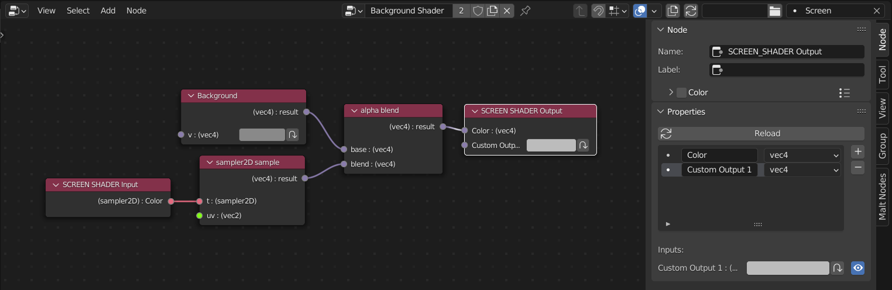

> Custom IO can be set up from the Input/Output node properties panel.  
>  
> Modifying the Custom IO will requires the recompilation of all graphs affected by it, so changes aren't applied automatically.  
You must click the *Reload* button to apply your changes.

These *custom IO* properties are exposed as sockets in nodes that execute these *graphs*.  
For example, the *Screen Pass* node in *Render Graphs* will expose as sockets the *custom IO* from the *Screen Shader* it's using.

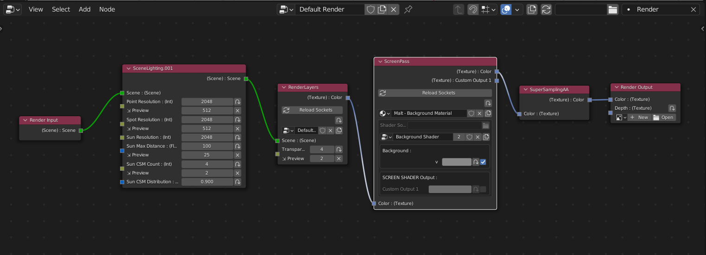

Some graph types (like Mesh) share their custom IO properties across all the materials in a scene, while others (like Screen) can be diferent for each graph.

<!--TODO
libraries
reload
node trees vs materials
-->

## Graph Types

### Mesh

> [Mesh Graph Reference](../../reference/Mesh-graph)

Mesh Graphs define the surface properties of an object. These are the equivalent to *Blender Material Nodes*. 
Mesh Graphs are always used as part of a Material attached to an Object.

#### Passes & Outputs

Multiple shader programs are generated from a single Mesh Graph: the Shadow Pass, the Pre Pass and the Main Pass. Each of them consisting of a vertex and a pixel shader.

The vertex shaders are generated from the CUSTOM_VERTEX_SHADER Output and the DISPLACEMENT_SHADER Output.  
The Shadow Pass and the Pre Pass pixel shaders are generated from the PRE_PASS_PIXEL_SHADER Output and the DEPTH_OFFSET output.  
The Main Pass pixel shader is generated from the MAIN_PASS_PIXEL_SHADER Output and the DEPTH_OFFSET output.  

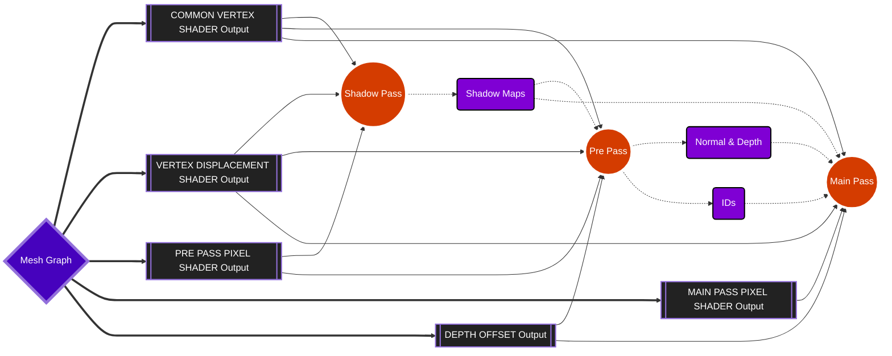

### Light

> [Light Graph Reference](../../reference/Light-graph)

Light Graphs define the color projected by a light at any given point. While most lights don't need a custom shader, this can be useful for certain effects, like the light emited from a projector or a flashlight.  
Lights with custom shaders are more expensive to render.
Light shaders don't take shadowmaps into account, shadows are handled by Mesh shaders.

Light Graphs are always used as part of a Material attached to a Light. 

### Screen

> [Screen Graph Reference](../../reference/Screen-graph)

Screen Graphs define screen-space shaders. The most common use case for screen-space shaders are post-processing effects, like color correction, or bloom.
However they can also fit other use cases, like deferred shading or precalculating textures, like AO, before the Main Pass.

Screen Graphs are always used as part of a Material, usually asigned to a Screen Pass node in a Render or Render Layer graph.

### Render & Render Layers

> [Render Graph Reference](../../reference/Render-graph)

> [Render Layer Graph Reference](../../reference/Render Layer-graph)

Render nodes define the steps for rendering a frame, from preparing the shadowmaps to performing the image antialiasing.

Most render engines only allow users to edit the render pipeline after the scene has been drawn, in the form of post-processing/compositing, but Malt exposes the full process for customization. 

*Render graphs* have the *RenderLayers* node, that executes a *Render Layer* graph.
The scene geometry is drawn inside *Render Layer*, using *Depth Peeling*.

#### Depth Peeling
Real-time rendering often relies heavily on screen-space techniques, however this usually doesn't work with tranparent objects.  
Malt renders opaque objects first, and then transparent objects in multiple overlapping layers (a.k.a. *Depth Peeling*), so every type of object can follow the same render path.  
However, it's important for screen-space shaders to avoid accidentaly covering back layers from the front ones.  
For this purpuse, the *Screen Node* has the *Layer Only* setting.
