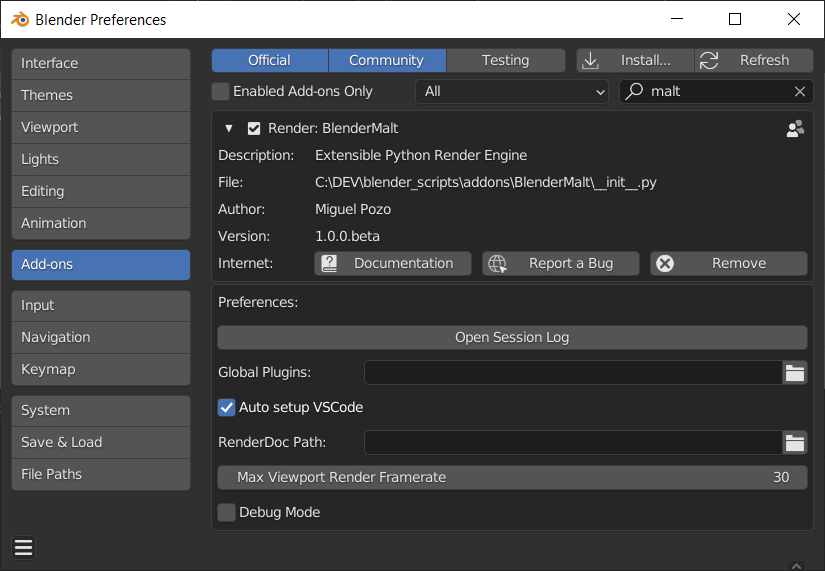
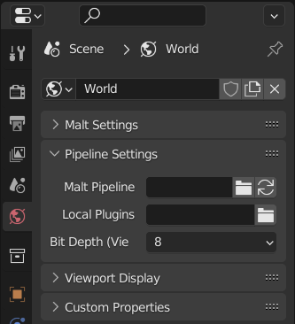
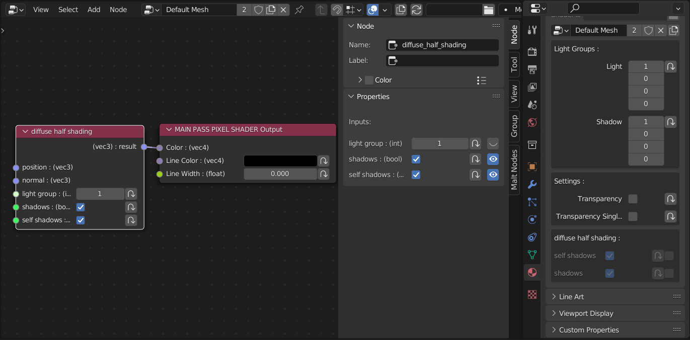
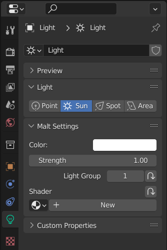
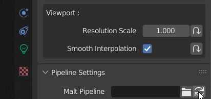

# Setup & Settings

## Addon Settings

- **Open Session Log**  
>Opens the current session log in a text editor.
- **Global Plugins**  
>The path to the *plugins* folder. See [Plugins](../Plugins) for more info.
- **Auto setup VSCode**  
>On file save, setups a VSCode project on your *.blend* file folder.
- **RenderDoc Path**  
>Path to the **renderdoccmd** executable, for [RenderDoc](https://renderdoc.org/) debugging.
- **Max Viewport Render Framerate**  
>Framerate cap for the viewport. Limiting *Blender* framerate can improve *Malt* performance and animation playback stability. Set it to 0 to disable it.
- **Debug Mode**  
>Include debug info in the *Session Logs*. Enabling it increases the log sizes and can negatively affect performance, don't enable it unless a developer asks you for it in a bug report.

## Pipeline Configuration Settings

The *Pipeline Configuration Settings* contain the settings to select and setup the *pipeline* itself.  

In *Malt*, the *pipeline* configuration and render settings are part of the *World* properties. This allows sharing the same setup across *Scenes* and *.blend* files.

  

- **Malt Pipeline**  
>The path to a custom *render pipeline*. If it's empty (the default), the *NPR Pipeline* will be used.  
>The button at the right is the *Reload Pipeline* operator, which fully restarts the renderer.  
- **Local Plugins**  
>The path to the *World* specific *plugins* folder. See [Plugins](../Plugins) for more info.  
- **Bit Depth (Viewport)**  
>The viewport image *bit depth*. Higher *bit depths* can yield better image quality (avoiding *banding* and *clamping*), but can bottleneck your *GPU<->CPU* bandwith at high resolutions.  
>Final renders are always sent to *Blender* as 32bit images for best quality, regardless of this setting.

### Material Settings
- **Shader Source**  
>GLSL source file for the material.  *(Ignored when a Node Tree is selected)*
- **Node Tree**  
>*Node Tree* used for this material.

The material panel will also show the parameters declared in its *Shader/Node Tree*.  

In code based materials, "ALL CAPS" uniforms and uniforms starting with an underscore "_" are treated as "private" and won't be shown in the material panel.  

For node based materials, visibility can be toggled from the node *UI*.  

### Light Settings

- **Color**  
>The light color if no custom shader is in use.
- **Radius**  
>The area of effect radius for *Point* and *Spot Lights.*
- **Angle**  
>*Spot light* cone angle.
- **Blend**  
>*Spot light* cone gradient angle.

## Pipeline Settings

The settings created by the active *pipeline* and *plugins* can be found in the *Properties Panel* inside a *Malt Settings* menu.  

[Pipeline Settings Reference](/reference/settings).
 

### Parameter Overrides

*Malt* uses different performance profiles, allowing you to choose the appropiate performance/quality tradeoff for different tasks.

> For example, you may want to use lower quality settings while modeling or animating, higher quality settings for material lookdev, and even higher for the final render.

Each setting can have a different value for each profile.
There are 3 performance profiles:  

- **Default**  
Used when the *Blender Viewport Shading Mode* is set to *Render* or when there's no active override.  
It's best to set Default settings at a quality level that provides a close result to the final render, while keeping a reasonable performance for viewport navigation.
- **Preview**  
Used when the *Blender Viewport Shading Mode* is set to *Preview*.  
It's best to set Preview settings at a quality level that allows you to edit assets and play animations in real time.
- **Final Render**  
Used for the final render (*F12*). For setting that are too heavy for the viewport, but needed for the final render quality.  

Any setting can be overridden for a specific profile by clicking on the *Override* button at its right. Otherwise the *Default* profile value will be used.  

