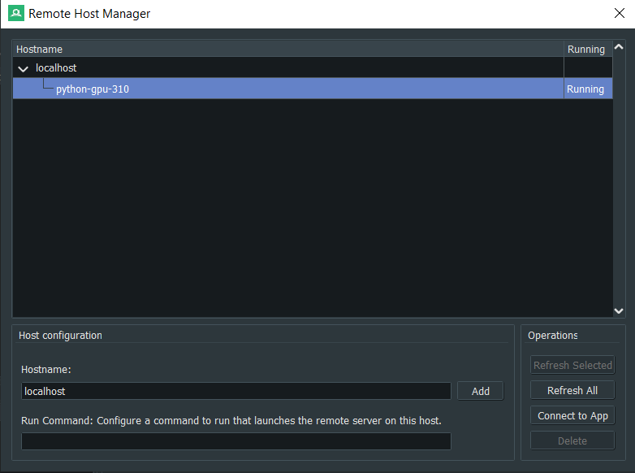
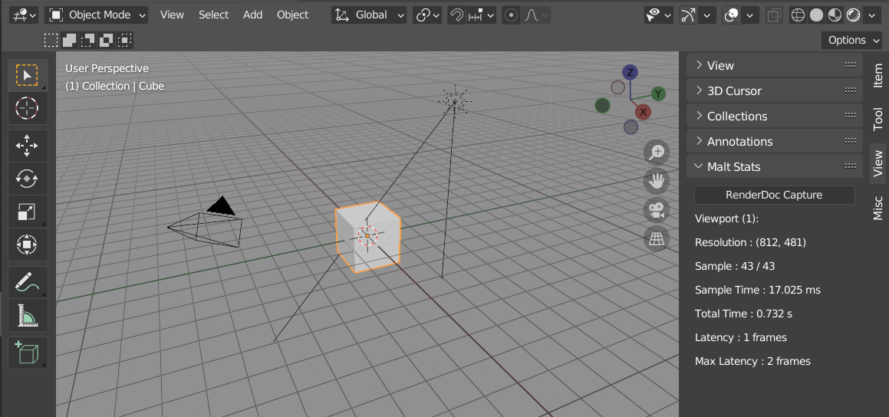

# External Tools

## VSCode

*Malt* has built-in integration with [VSCode](https://code.visualstudio.com), including a workaround to provide GLSL intellisense via C++ language servers.  
When *Malt* is the active render engine, it will auto-setup a *VSCode* workspace on the same folder you save your *.blend* file.  
>*(This feature can be disabled in the Addon Preferences)*

<iframe style="position: absolute; top: 0; left: 0; bottom: 0;right: 0; width:100%; height:100%; margin:0; border:0;" 
src="https://www.youtube-nocookie.com/embed/UjsW7Ce0BKo" frameborder="0" allow="accelerometer; autoplay; clipboard-write; encrypted-media; gyroscope; picture-in-picture" allowfullscreen></iframe>

## RenderDoc

*Malt* has built-in integration with [RenderDoc](https://renderdoc.org).  
It can be enabled by setting path to the **renderdoccmd** executable in the addon settings.  
Onnce Malt has been initialized, RendeDoc can be attached to Malt through the [attach to running instance](https://renderdoc.org/docs/window/capture_connection.html) option.  

Captures can be triggered directly through the Blender UI:
