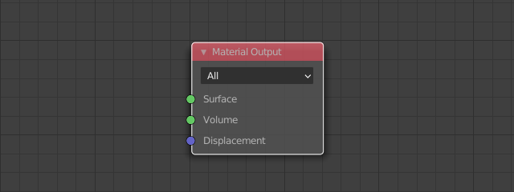

# From Nodes To Code

This tutorial will teach you how to make your own *Malt* shaders.

*Malt* shaders are written in *GLSL* (OpenGL Shading Language), the shader programming language used by *OpenGL* and *Vulkan*.

This tutorial assumes you are already familiar with *EEVEE* nodes.  
You may be surprised by how much of your knowledge about node based programming can easily be applied to code and how much more powerfull and convenient can be for advanced tasks.

## Before we start

Shader files are just plain text, so any text editor works for writing them.  
But we can make our lifes much easier by using a code editor.

### Visual Studio Code
*Malt* has built-in integration with [VSCode](https://code.visualstudio.com/download), it's free, cross-platform and open source so go ahead, download and install it!

### After installing Visual Studio Code:

1. Open Blender, change the render engine to *Malt* and save the *.blend* file in a new folder.  
2. Open this newly created folder in your OS file explorer and *Right Click > Open with Code*.
3. Create a new file and save it as ```malt-tutorial.mesh.glsl```. (or any othe name, but make sure it ends in ```.mesh.glsl```)
4. VSCode will tell you it has extensions for that file format and will ask you if you want to install them, say yes!
5. Select the shader file as the *Shader Source* for a new material (*Material Properties* Panel).

Now we can make changes in our shader file and as soon as we save it (*Ctrl+S*) Malt will reload it.

Note: When you save the blend file in step 1 and *Malt* is active it will auto-create a `.vscode` folder in the root of your new folder which includes a `settings.json` file that will help the extensions installed in step 4 work properly.

_Click image below to view a video of this installation/setup process in youtube_
[](http://www.youtube.com/watch?v=UjsW7Ce0BKo "Malt VSCode config")

## First Contact

Let's start by looking at some basic *Malt* examples and what would be their *EEVEE* counterparts, so you can see how they compare to each other.  
Read the code, but don't worry if you don't really understand it, we will take a more detailed look at it later.  

To get a better feel of it, let's test this examples as we go.  
You could just copy-paste them, but you will get a better grasp by typing them yourself.  
It will also serve to get familiar with the extra goodies VSCode provides, like code auto-completion.

If you miss-type something, you will see an error pop up in the Material panel inside *Blender* that will tell you what and where the error is.

Try to play with the examples, modify them, break them on purpose and take a look at the errors.

### Starting Point (an empty shader)

<div style="width: 50%; float:left">

```glsl
#include "Pipelines/NPR_Pipeline.glsl"

void COMMON_PIXEL_SHADER(Surface S, inout PixelOutput PO)
{

}
```

</div>

<div style="width: 50%; float:right">



</div>

<div style="clear: both"></div>

*Just an empty black shader.*  
*Even the most advanced procedural shader you can imagine needs this.*

### Flat Color

<div style="width: 50%; float:left">

```glsl
#include "Pipelines/NPR_Pipeline.glsl"

uniform vec3 color = vec3(0,1,0);

void COMMON_PIXEL_SHADER(Surface S, inout PixelOutput PO)
{
    PO.color.rgb = color;
}
```

</div>

<div style="width: 50%; float:right">


</div>

<div style="clear: both"></div>

*See how a new color property has appeared in your Material panel?*  
*Could you change the default green value ```vec3(0,1,0)``` in the code to red?*  
*What happens if you set ```vec3(0.5)``` as the default value?*  

> If you have edited a property in the UI, you can always *Right Click > Reset to Defaul Value*

### Textures

<div style="width: 50%; float:left">

```glsl
#include "Pipelines/NPR_Pipeline.glsl"

uniform int uv_channel = 0;
uniform sampler2D color_texture;

void COMMON_PIXEL_SHADER(Surface S, inout PixelOutput PO)
{
    vec2 texture_coordinates = S.uv[uv_channel];
    
    vec4 sampled_color = texture(color_texture, texture_coordinates);
    
    PO.color = sampled_color;
}
```

</div>

<div style="width: 50%; float:right">


</div>

<div style="clear: both"></div>

*In programming, the first element from a list is the number 0, so the first UV from your mesh is the number 0.*  
*It's not that weird if you think of it as the offset from the start of the list.*

### Lighting

<div style="width: 50%; float:left">

```glsl
#include "Pipelines/NPR_Pipeline.glsl"

uniform vec3 color = vec3(0,1,0);

void COMMON_PIXEL_SHADER(Surface S, inout PixelOutput PO)
{
    PO.color.rgb = color * get_diffuse();
}
```

</div>

<div style="width: 50%; float:right">


</div>

<div style="clear: both"></div>

*See how we can multiply colors just by using the multiply sign ```color * get_diffuse()``` ?*  
*The same goes for addition (+), subtraction (-) and division (/).*  
*Isn't that cool?*  
*You can even combine them in the same line and use parethesis, like ```vec3 result = vec3(1) - (A+B+C) / 3.0;```.`*   
*Now compare it with the same formula in node form!*


### Recap

It's time for something that looks a bit more like an actual material.
Let's combine the previous examples!

<div style="width: 50%; float:left">

```glsl
#include "Pipelines/NPR_Pipeline.glsl"

uniform vec3 ambient_color = vec3(0.5,0.5,0.5);

uniform int uv_channel;
uniform sampler2D color_texture;

void COMMON_PIXEL_SHADER(Surface S, inout PixelOutput PO)
{
    vec3 light_color = get_diffuse() + ambient_color;
    
    vec2 texture_coordinates = S.uv[uv_channel];
    
    vec4 surface_color = texture(color_texture, texture_coordinates);

    vec3 result = surface_color.rgb * light_color;
    
    PO.color.rgb = result;
}
```

</div>

<div style="width: 50%; float:right">


</div>

<div style="clear: both"></div>

Woah! That was a lot of information, right?  
It's ok if you don't feel like you actually understand it as long as you have a rough intuition of what's going on.

Now would be a good time to look at the [Shader Examples](https://github.com/bnpr/Malt/tree/master/Shader%20Examples).  
Each of them implements a single feature, why don't you try to mix some of them in the same shader?  
For example, a gradient material with outlines, rim lights and ambient occlusion.

## GLSL

On the last chapter we have relied on examples and intuition.  
You could continue just by copy-pasting and combining examples, but you would always feel out of control.

Luckily GLSL is a very small language, so there's not really a lot of details to learn.

There are 2 main concepts you should understand, *Functions* and *Variables* .  
*Functions* are basically the same as nodes, they take some parameters and gives you a result.  
Instead of connecting *Functions* with wires, we give names to their results, so we can refer to them later.  
Those names where we store results are *Variables*.

### Comments

Before we go further, let's start with an easy one. Comments!

```glsl
// This is a comment!
// Comments are ignored by the computer, they are for the people reading the code.
// Any line that starts with 2 dashes "//" is a comment.
```

### Variables

*Variables* are like node sockets, they have a type, a name and a value.

```glsl
// We create variables by writing their type, followed by their name and a semicolor:
// type name;
// The name can be whatever you want as long as it goes all together;
// type ThisReallyLong_and_w3iRd0_name_is_OK_1234;
// We can optionally assign them a value when we create it:
// type name = value;
// Once a variable has been created, you can change its value as many times as you want.
// name = other_value;

// The types we use the most are floats and vectors

// Floats are just computer lingo for numbers.
float some_number = 1;
// They can be negative too
some_number = -1;
// Have decimals
some_number = -1.5;
// And can be as big as you want
some_number = 176189672672868126.71671861876871678;

// Floats can be added, subtracted, multiplied and divided
float a = 1;
float b = 2;
some_number = a + b; 
// Now some_number is  3
some_number = a - b;
// Now some_number is -1
some_number = a * b;
// Now some_number is  2
some_number = a / b;
// Now some_number is  0.5

// Vectors are a group of 2, 3 or 4 floats
// We use them for positions and normals
vec2 position_2d = vec2(1,2);
vec3 position_3d = vec3(1,2,3);
vec3 up_normal = vec3(0,0,1);
// And colors too
vec3 green = vec3(0,1,0);
vec4 semi_transparent_red = vec4(1,0,0,0.5);

// We can read their individual properties by typing the vector name followed by a dot (.) and the name of the property
float x_position = position_3d.x; //1
float y_position = position_3d.y; //2
float z_position = position_3d.z; //3
// It also works for writing
position_3d.x = 0; // Now position_3d is (0,2,3)

// Since vectors are used for colors too, this is also valid:
float red_channel = green.r;
float green_channel = green.g;
float blue_channel = green.b;
float alpha_channel = semi_transparent_red.a;

// Using rgba or xyzw as properties name is just a matter of preference, they are 100% equivalent
vec3 some_color = vec3(1,2,3);
some_color.x = 0; //Now some_color.r is 0

// Additionaly this kind of combinations are also valid
position_2d = position_3d.xy; // (0, 2)
some_color = semi_transparent_red.rgb; //(0,1,0)
```

### Functions

*Functions* are equivalent to nodes, they take some parameters and gives you a result.

```glsl
// We declare functions by typing the type of value they return,
// followed by its name and a pair of parenthesis.
vec3 give_me_a_green_color()
{
    vec3 green_color = vec3(0,1,0);
    
    // We return a value by typing the keyword "return" followed by the return value and a semicolor.
    return green_color;
}

// If a function doesn't return any value, its type is "void".
// We will see later why functions that don't return a value can also be useful.
void example_function()
{
    //To use a function (a.k.a. call a function) we type its name followed by a pair of parenthesis.
    vec3 color_result = give_me_a_green_color();
    // color_result is now (0,1,0)
}

// If a funtion takes input parameters, we write their type and name inside the parenthesis.
// Each parameter must be separated by commas.
float add_two_numbers(float first_number, float second_number)
{
    float result = first_number + second_number;

    return result;
}

void another_example_function()
{
    float A = 1;
    float B = 2;

    // For calling a function that takes parameters, we write their values separated by commas.
    float C = add_two_numbers(A, B);
    // C is now 3.
}

// Functions can also have output parameters
void give_me_two_colors(inout vec3 first_result, inout vec3 second_result)
{
    first_result = vec3(1,0,0);
    second_result = vec3(0,1,0);
}

void third_example()
{
    vec3 A;
    vec3 B;

    give_me_two_colors(A, B);
    // Now A is (1,0,0) and B is (0,1,0).
}

```


>If you reached here, congrats\!  
>You can share your questions and feedback in this [thread](https://github.com/bnpr/Malt/discussions/46)\.  
>I'm working on new chapters, meanwhile, [The Book of Shaders](https://thebookofshaders.com/) is a great resource\!  


